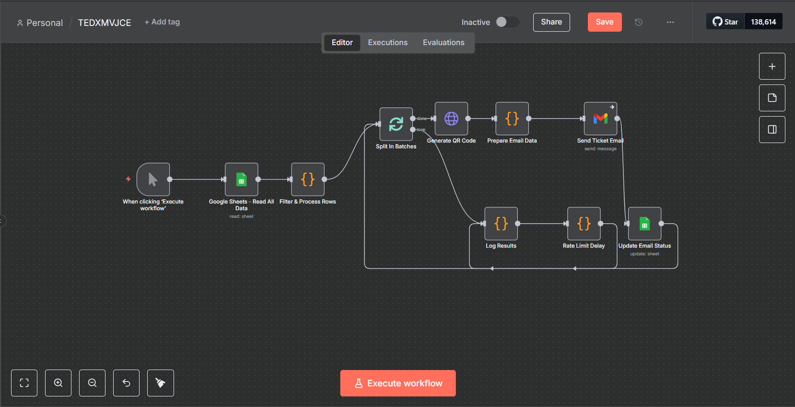
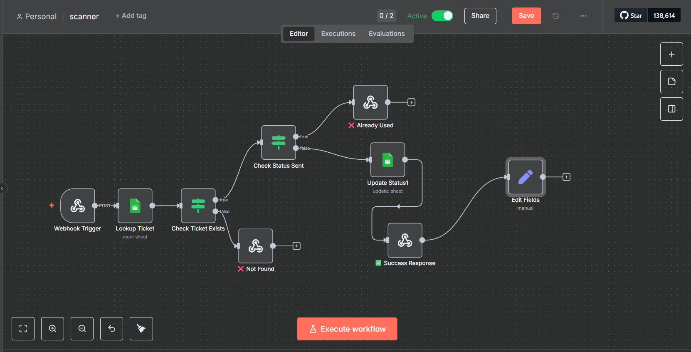
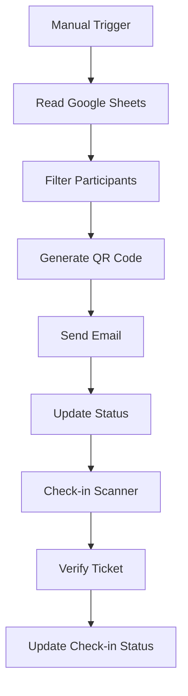

# TEDx MVJCE Event Management Automation



An n8n automation system for TEDx MVJCE event management, featuring automated ticket distribution with QR codes and real-time check-in scanning.

## 🎯 Overview

This system automates the entire ticket lifecycle from distribution to check-in verification:

- **Automated Ticket Emails**: Send personalized tickets with QR codes
- **Real-time Check-in**: QR scanning and manual verification at events
- **Google Sheets Integration**: Centralized participant data management
- **Professional Templates**: Branded HTML emails with embedded QR codes

## 🏗️ System Components



1. **Email Workflow** (`email.json`) - Automated ticket sending
2. **Check-in Workflow** (`scann.json`) - Ticket verification  
3. **Scanner Interface** (`index.html`) - Mobile QR scanner

### Workflow Flow


## 🚀 Quick Setup

### 1. Prerequisites
- n8n instance (self-hosted or cloud)
- Google Account for Sheets and Gmail
- Web server for scanner interface

### 2. Google Sheets Setup
Create a sheet with columns:
- **Name**, **Email**, **Ticket ID** (required)
- **Phone**, **Event Name**, **Event Date**, **Event Location**
- **Status**, **Check-in Status** (auto-updated)

### 3. Configure Credentials
Set up in n8n:
- **Google Sheets OAuth2**: `https://www.googleapis.com/auth/spreadsheets`
- **Gmail OAuth2**: `https://www.googleapis.com/auth/gmail.send`

### 4. Update Configuration
Replace placeholders in workflows:
```javascript
"YOUR_GOOGLE_SHEETS_ID_HERE" → "your-sheet-id"
"YOUR_GMAIL_CREDENTIAL_ID" → "your-gmail-credential-id"
```

### 5. Deploy Scanner
Update webhook URL in `index.html`:
```javascript
const WEBHOOK_URL = 'https://your-n8n-instance.com/webhook-test/checkin';
```

## 📧 Email Template Features

- TEDx MVJCE branding and colors
- Event details and ticket information
- Embedded QR code for check-in
- Mobile-responsive design
- Professional HTML formatting

## 🔍 Usage

### Sending Tickets
1. Add participant data to Google Sheets
2. Run email workflow manually
3. Monitor execution logs
4. Verify emails sent and status updated

### Event Check-in
1. Open scanner interface on mobile
2. Scan QR codes or enter ticket IDs manually
3. View real-time success/error feedback
4. Track check-in statistics

## 🛠️ Troubleshooting

### Common Issues
- **Emails not sending**: Check Gmail credentials and API limits
- **Scanner not working**: Verify webhook URL and CORS settings
- **Sheets access denied**: Re-authenticate OAuth2 credentials

### Debug Tools
- Test Connection button in scanner interface
- Console logging for detailed errors
- Alternative URL testing

## ⚙️ Technical Details

### APIs Used
- **Google Sheets API**: Participant data storage
- **Gmail API**: Automated email sending
- **QR Server API**: QR code generation

### Security
- OAuth2 authentication
- Rate limiting (2-second email delays)
- Input validation and sanitization
- HTTPS enforcement

## 📊 Features

- **Rate Limiting**: Prevents email spam
- **Error Handling**: Comprehensive logging
- **Mobile Interface**: Responsive QR scanner
- **Real-time Stats**: Success/failure tracking
- **Duplicate Prevention**: Avoids sending duplicate emails

## 📞 Support


- **Issues**: [GitHub Issues](https://github.com/mugenkyou/TEDXMVJ-n8n-automation/issues)

---

<div align="center">

**🎤 TEDx MVJCE Event Management Automation**

*Empowering event organizers with intelligent automation*

[](https://n8n.io)
[](https://sheets.google.com)
[](https://developers.google.com/gmail)

</div>